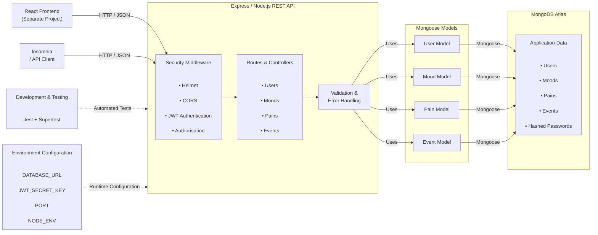
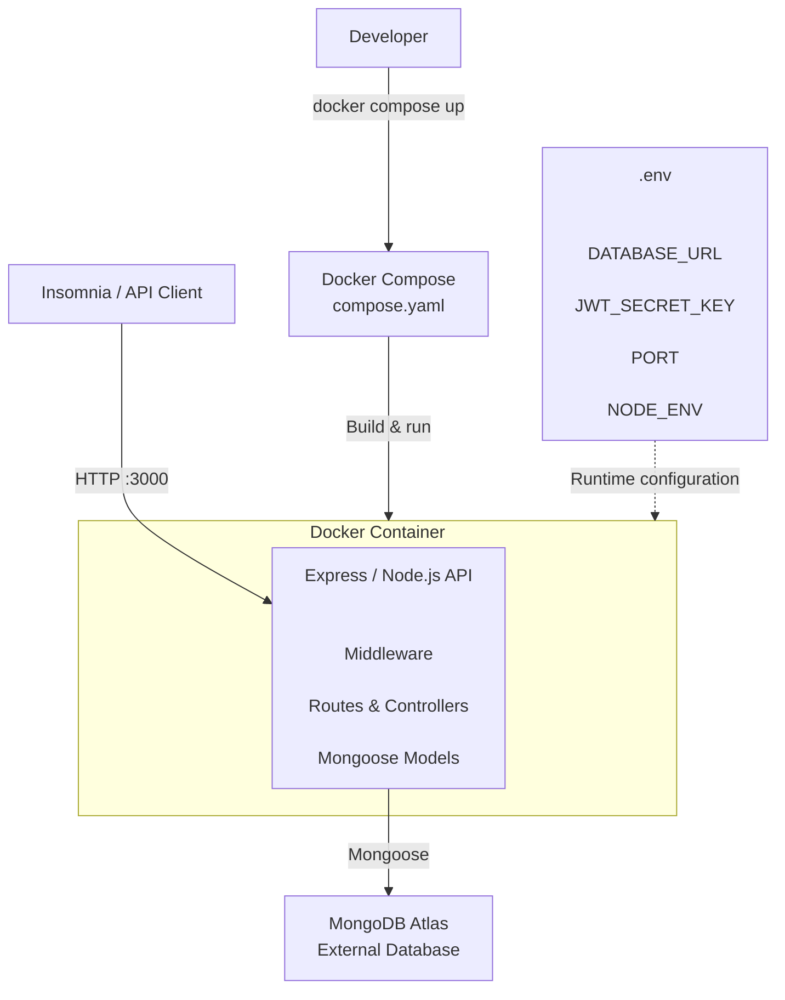
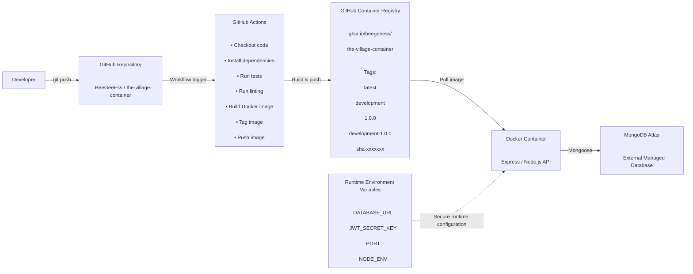

Test test

<picture>
  <source media="(prefers-color-scheme: dark)" srcset="./images/banner-dark.png">
  <source media="(prefers-color-scheme: light)" srcset="images/banner-light.png">
  
</picture>

## Navigation

- [Overview of Project](#overview-of-project)
- [The Village Wellness App](#the-village-wellness-app)
- [Application Architecture](#application-architecture)
- [Containerised Architecture](#containerised-architecture)
- [CI/CD Architecture](#cicd-architecture)
- [Project Features](#project-features)
- [Tech Stack](#tech-stack)
- [Packages](#packages)
- [System Requirements](#system-requirements)
- [Project Structure](#project-structure)
- [Database Structure](#database-structure)
- [Authentication](#authentication)
- [API Endpoints](#api-endpoints)
- [API Request Handling](#api-request-handling)
- [Security](#security)
- [Error Handling](#error-handling)
- [Installation](#installation)
- [Environment Variables](#environment-variables)
- [Running the Server](#running-the-server)
- [Docker Containerisation](#docker-containerisation)
- [Docker Image Tags](#docker-image-tags)
- [CI/CD](#cicd)
- [Container Registry](#container-registry)
- [Scripts](#scripts)
- [Testing](#testing)
- [Deployment](#deployment)
- [JavaScript Style Guide](#javascript-style-guide)
- [License](#license)
- [References](#references)
- [Authors](#authors)

## Overview of Project

This repository contains an express.js/node.js backend API for a wellness app. The API includes full CRUD operations for mood, pain, events and users. The API connects to a data in MongoDB Atlas, and uses JWT authentication and roles to for authorisation. This application was created as part of an academic Web Development assessment using MongoDB, Express.js, React and Node.js (MERN Stack).

This assessment has containerised the backend API using Docker. Using GitHub Actions, the Docker image has been built and published to the GitHub Container Registry (GHCR).

Visit the project [profile](https://github.com/The-Village-Wellness-App) for more information.

## The Village Wellness App

The Village Wellness App is a web-based health and wellbeing tracking application designed to help users monitor changes in their mood and physical pain over time. The application allows users to record structured entries using rating scales select predefined labels that describe their emotional or physical state, and optionally add contextual notes.
These entries are then visualised through time-based graphs, enabling users to identify patterns or trends in their wellbeing.

The application also allows users to add event markers to their timeline, such as starting a new medication, beginning therapy, or experiencing a significant life event. These markers provide additional context that may help users understand potential factors influencing their mood or pain levels. By combining structured tracking with visualisation tools, The Village Wellness App aims to support self-reflection and provide users with useful insights that may assist discussions with healthcare professionals.

## Application Architecture

The following diagram represents the existing architecture of The Village Wellness App backend before containerisation.



**Figure 1: Existing Application Architecture**

## Containerised Architecture

The following diagram represents the architecture of The Village Wellness App backend after the Express.js application has been containerised using Docker for development. Docker Compose manages the development container, while MongoDB Atlas remains an external managed database.



**Figure 2: Containerised Development Architecture**

## CI/CD Architecture

The following diagram represents the continuous integration and continuous delivery (CI/CD) architecture used to automatically build and publish the containerised backend application to GitHub Container Registry.



**Figure 3: CI/CD Architecture**

## Project Features

- Full CRUD operations for users, moods, pains, and events
- JWT-based authentication with 7-day token expiry
- Role-based authorization (admin and regular user roles)
- Date-range filtering for mood and pain entries
- Secure password hashing with scrypt and salt
- Comprehensive test coverage (5 test suites across routers)
- Input validation at model and route levels
- Consistent error handling with appropriate HTTP status codes
- Helmet security middleware
- CORS configuration
- Automated Jest/Supertest testing
- Docker containerisation
- Automated Docker image builds using GitHub Actions
- Versioned Docker image tags
- GitHub Container Registry image publishing

## Tech Stack

### Chosen Technologies

- MongoDB
- Express.js
- Node.js
- Mongoose
- JWT
- Helmet
- CORS
- Jest
- Supertest
- Docker
- GitHub Actions
- GitHub Container Registry

### Purpose of Each Technology

| Technology                | Purpose                                             |
| ------------------------- | --------------------------------------------------- |
| MongoDB                   | Stores the applications data                        |
| Express.js                | Handles API routing and middleware                  |
| Node.js                   | Runs the backend server environment                 |
| Mongoose                  | MongoDB object modelling and database communication |
| JWT                       | Authentication                                      |
| Helmet                    | HTTP security headers                               |
| CORS                      | Cross-origin browser access control                 |
| Jest                      | Automated testing                                   |
| Supertest                 | HTTP/API testing                                    |
| Docker                    | Application containerisation                        |
| GitHub Actions            | CI/CD automation                                    |
| GitHub Container Registry | Docker image storage                                |

### Industry Relevance

The MERN stack is widely used in modern full-stack web development due to its scalability, security, performance and ability to use JavaScript across both frontend and backend development[\*](#references).

The technologies used in the MERN stack are some of the most widely used technologies in present time.

See State of JavaScript graphs[\*](#references):

- [React Usage](https://share.devographics.com/share/prerendered?localeId=en-US&surveyId=state_of_js&editionId=js2025&blockId=front_end_frameworks_ratios&params=&sectionId=libraries&subSectionId=front_end_frameworks)
- [Express Usage](https://share.devographics.com/share/prerendered?localeId=en-US&surveyId=state_of_js&editionId=js2025&blockId=back_end_frameworks_ratios&params=&sectionId=libraries&subSectionId=back_end_frameworks)
- [Testing with Jest](https://share.devographics.com/share/prerendered?localeId=en-US&surveyId=state_of_js&editionId=js2025&blockId=testing_ratios&params=&sectionId=libraries&subSectionId=testing)

See Stack Overflow graphs[\*](#references):

- [MongoDB (No-SQL Databases)](https://survey.stackoverflow.co/2025/technology#most-popular-technologies-database-database)
- [Node, React, Express Usage](https://survey.stackoverflow.co/2025/technology#most-popular-technologies-webframe-webframe)
- [Javascript Usage](https://survey.stackoverflow.co/2025/technology#most-popular-technologies-language-language)

### Comparison to Alternative Technologies

| Chosen Technology | Alternative | Reason Chosen                                |
| ----------------- | ----------- | -------------------------------------------- |
| MongoDB           | PostgreSQL  | Flexible, dynamic, durable, high-performance |
| Express.js        | Django      | Minimalist, customisable, JavaScript-based   |
| React             | Angular     | Component flexibility, rapid development     |
| Node.js           | ASP.NET     | Universal JavaScript development environment |

### Licensing Information

| Technology | License                           |
| ---------- | --------------------------------- |
| MongoDB    | Server Side Public License (SSPL) |
| Express.js | MIT License                       |
| React      | MIT License                       |
| Node.js    | MIT License                       |

\*Note: Though MongoDB uses an SSPL licence, it is still appropriate to licence this project under MIT, because the application:

1. Is a public educational project
2. Uses MongoDB as an external database, and connects through Mongoose
3. Does not redistribute, modify or host MongoDB software

## Packages

```js
"cors": "^2.8.6",
"dotenv": "^17.4.2",
"express": "^5.2.1",
"helmet": "^8.1.0",
"jsonwebtoken": "^9.0.3",
"mongoose": "^9.3.0",
"smallog": "^1.0.2"

devDependencies

"eslint": "^9.39.4",
"globals": "^17.6.0",
"jest": "^30.3.0",
"supertest": "^7.2.2"
```

## System Requirements

- Node.js (LTS recommended, v16+)
- npm
- A MongoDB database (Atlas or self-hosted)
- Recommended: 512MB+ RAM for small deployments

## Project Structure

```js
📁 village-backend
    📁 src
        📁 controllers
            ─ EventRouter.js
            ─ MoodRouter.js
            ─ PainRouter.js
            ─ UserRouter.js
        📁 middleware
            ─ UserAuthentication.js
            ─ UserAuthorisation.js
        📁 models
            ─ EventModel.js
            ─ MoodModel.js
            ─ PainModel.js
            ─ UserModel.js
        📁 utils
            📁 _dev
                ─ dbSeed.js
                ─ dbWipe.js
                ─ envSetup.js
            ─ dbConnectionManager.js
            ─ jwtUtils.js
        ─ index.js
        ─ server.js
    📁 tests
        ─ eventRouter.test.js
        ─ moodRouter.test.js
        ─ painRouter.test.js
        ─ server.test.js
        ─ userRouter.test.js
    ─ example.env
    – .eslintrc.json
    – eslint.config.mjs
    – jest.config.js
    ─ LICENSE
    ─ package-lock.json
    ─ package.json
    ─ README.md
```

NOTE: The .env file is not shown in the project structure as it is intentionally kept out of the GitHub repo due to containing configuration and secrects. The example.env file provides on overview on what environment variables need to be configured.

## Database Structure

This project uses MongoDB as the database, and Mongoose as the connection between the Express app and MongoDB.

MongoDB Atlas is kept external to the Docker container. This allows containers to remain replaceable without affecting persistent application data.

### Collections

#### Users

```json
{
  "_userId": "ObjectId",
  "username": "davejohnson",
  "password": "hashed_password",
  "email": "davo@example.com",
  "isAdmin": true,
  "theme": "light",
  "salt": "a8f3c91d2ef4...",
  "createdAt": "2026-05-24T07:15:22.123Z",
  "updatedAt": "2026-05-24T09:41:10.456Z"
}
```

#### Pain

```json
{
  "_painId": "ObjectId",
  "user": "davejohnson",
  "value": 3,
  "location": "neck",
  "optional_text": "string",
  "occurred_at": "2026-05-24T07:15:22.123Z",
  "createdAt": "2026-05-24T07:15:22.123Z",
  "updatedAt": "2026-05-24T09:41:10.456Z"
}
```

#### Events

```json
{
  "_eventId": "ObjectId",
  "user": "davejohnson",
  "title": "breakup",
  "description": "Broke up with my girlfriend Alysha",
  "category": "life_event",
  "occurred_at": "2026-05-24T07:15:22.123Z",
  "createdAt": "2026-05-24T07:15:22.123Z",
  "updatedAt": "2026-05-24T09:41:10.456Z"
}
```

#### Mood

```json
{
  "_moodId": "ObjectId",
  "user": "davejohnson",
  "value": 5,
  "optional_text": "Nothing much happened today, boring day at work",
  "occurred_at": "2026-05-24T07:15:22.123Z",
  "createdAt": "2026-05-24T07:15:22.123Z",
  "updatedAt": "2026-05-24T09:41:10.456Z"
}
```

## Authentication

Authentication uses JSON Web Tokens (JWT). Clients send tokens in the `Authorization` header as `Bearer <token>`. Tokens are issued on signup/login and validated by `src/utils/jwtUtils.js` with a 7-day expiry. Secrets are read from environment variables.

Admin users are not created through the public signup endpoint. Admin accounts must be added directly in the database seed data or created by inserting a user document with `isAdmin: true` into MongoDB.

Password reset flow: the backend exposes endpoints to support a standard "forgot password" flow. Clients should call `POST /users/forgot-password` with an email to initiate a reset; the server will create a short-lived reset token and (in production) send it to the JSON response body. To complete a reset the client calls `POST /users/reset-password` with the token and new password. The server validates the token and updates the hashed password.

## API Endpoints

Quick overview:

- **Authorization:** send `Authorization: Bearer <token>` for protected endpoints (all `/moods`, `/pains`, `/events`, and most `/users/*` except `/signup` and `/login`).
- **Admin-only:** `GET /users`, `GET /users/admin/dashboard` require an admin user. Admin can also find specific user `GET /users/:userId`.
- **Params & queries:** use route params (`:userId`, `:moodId`, `:eventId`) and optional query filters, e.g. `?startDate=2026-05-01&endDate=2026-05-31`.
- **Responses:** `201` on create, `200` on success, `400/401/403/404/500` for errors as appropriate.
- **Example (login):**

```bash
curl -X POST http://localhost:3000/users/login \
  -H "Content-Type: application/json" \
  -d '{"email":"user@example.com","password":"password123"}'
```

### User Endpoints

- **GET /users** — Admin only: retrieve all users
- **GET /users/:userId** — Admin or the user themself: retrieve a user's profile (password/salt omitted)
- **GET /users/admin/dashboard** — Admin only: admin dashboard data
- **POST /users/signup** — Public: create a new account
- **POST /users/login** — Public: obtain JWT for login
- **PATCH /users/:userId** — Authenticated user (self-only): update own profile (username, email, password, theme)
- **DELETE /users/:userId** — Authenticated user (self-only): delete own account
- **DELETE /users/:userId/admin** — Admin only: delete another user's account (admins may also use with their own ID)
- **POST /users/forgot-password** — Public: initiate password reset with `{ email }`; server generates a short-lived token and sends it by email (token not returned in API responses)
- **POST /users/reset-password** — Public: complete reset with `{ token, password }`; server validates token and updates hashed password

Note: the `forgot-password` flow is email/token-based so users do not need to provide their internal MongoDB `_id`. There is no admin-only reset endpoint implemented by default. Admins who need to reset a user's password must perform the change directly in the database/seed data.

### Mood Endpoints

- **GET /moods** - Retrieve all mood entries
- **GET /moods/moodId** - Retrieve a specific mood entry
- **POST /moods** - Create a mood entry
- **PATCH /moods/moodId** - Update a mood entry
- **DELETE /moods/moodId** - Delete a mood entry

### Pain Endpoints

- **GET /pains** - Retrieve all pain entries
- **GET /pains/painId** - Retrieve a specific pain entry
- **POST /pains** - Create a pain entry
- **PATCH /pains/painId** - Update a pain entry
- **DELETE /pains/painId** - Delete a pain entry

### Event Endpoints

- **GET /events** - Retrieve all event entries
- **GET /events/eventId** - Retrieve a specific event entry
- **POST /events** - Create an event entry
- **PATCH /events/eventId** - Update an event entry
- **DELETE /events/eventId** - Delete an event entry

## API Request Handling

- Requests and responses use JSON bodies.
- Route parameters (`:userId`, `:moodId`, etc.) and query parameters (e.g. `startDate` / `endDate`) are used for resource selection and filtering.
- Authorization is enforced by middleware that reads `Authorization` headers and attaches the authenticated user to `request.customData.user`.
- Input is validated at the route and model level; Mongoose schemas enforce field constraints.

## Security

- `helmet` is used to set secure HTTP headers.
- CORS is configured to restrict origins; adjust `src/server.js` `handyCorsConfig` for production domains.
- Passwords are salted and hashed using `scrypt` (see `UserModel`).
- Store `JWT_SECRET_KEY` and database credentials in environment variables and run the service behind HTTPS.
- The Docker container runs the application using the non-root node user.
  This reduces the privileges available to the application process inside the container.

## Error Handling

Routes return appropriate HTTP status codes: `400` for bad requests/validation errors, `401` for authentication failures, `403` for forbidden actions, `404` for not found, and `500` for server errors. Sensitive error details are not exposed to clients.

## Installation

Clone, install, and create env file, then run locally:

```bash
git clone https://github.com/The-Village-Wellness-App/the-village-container.git
cd the-village-container
npm install
npm run setup:env
npm run db:seed
npm run start   # or `npm run dev` for hot-reloading
```

## Environment Variables

To run this project, create an `.env` file in the root directory by running `setup:env`

```env
PORT=3000
DATABASE_URL=mongodb+srv://
JWT_SECRET_KEY=
NODE_ENV=development
```

The repository’s .gitignore and .dockerignore exclude .env.
The included example.env file can be used as a template without containing real secrets.

## Running the Server

Run the production server by entering into the terminal
`npm run start`

Or if you want hot-reloading, run dev mode
`npm run dev`

## Docker Containerisation

Docker packages the backend app and its dependencies into a reusable container image.

This Docker file uses an official Node.js 26 Alpine Linux base image:

`FROM node:26-alpine`

The applications dependencies are then installed using `npm ci`. Development dependencies are excluded from runtime:

`RUN npm ci --omit=dev`

Docker Compose is used to define the development container's runtime configuration.

The compose.yaml file specifies how the Dockerfile is built, maps the application port, and provides environment variables to the container.

The development container can be built with:

`docker compose build`

The development container can be built with:

`docker compose up`

The Compose configuration loads environment variables from the local .env file at runtime. Ensuring that secrets are not contained within the GitHub repo, or the Docker build.

The application is available at:

http://localhost:3000

Port 3000 on the host machine is mapped to port 3000 inside the container.

MongoDB is not containerised as part of this project.

The application connects to MongoDB Atlas as an external managed database using the DATABASE_URL environment variable.

To stop the development container:

`docker compose down`

## Docker Image Tags

Images are stored using GitHub Container Registry.

The image naming convention is:
ghcr.io/beegeeess/the-village-container:(insert tag)

The Village container generates the following tags:

- ghcr.io/beegeeess/the-village-container:latest | Most recent Image
- ghcr.io/beegeeess/the-village-container:development | Development Environment
- ghcr.io/beegeeess/the-village-container:1.0.0 | Application Version
- ghcr.io/beegeeess/the-village-container:development-1.0.0 | Environment and Version
- ghcr.io/beegeeess/the-village-container:sha-xxxxxxx | Specific Git Commit

## CI/CD

GitHub Actions automates the Docker image build and publishing process.

The workflow is triggered when code is pushed to the main branch or when manually triggered.

The workflow:

1. Checks out the repository.
2. Sets up Docker Buildx.
3. Converts the repository name to lowercase for Docker compatibility.
4. Reads the application version from package.json.
5. Generates a short Git commit identifier.
6. Authenticates with GitHub Container Registry.
7. Builds the Docker image.
8. Applies environment, version and Git commit tags.
9. Pushes the image to GHCR.

The workflow uses the GitHub-provided GITHUB_TOKEN for authentication to GHCR.

Application secrets such as DATABASE_URL and JWT_SECRET_KEY are not stored in the repository or Docker image.

## Container Registry

GitHub Container Registry (GHCR) stores the Docker images produced by the CI/CD workflow.

The registry path is:

ghcr.io/beegeeess/the-village-container

Using GHCR keeps the container images associated with the GitHub repository and its source-code history.

The image tags allow a specific version or commit to be identified and deployed. [See Tags Here.](#docker-image-tags)

## Scripts

The following scripts can be used for this project:

| Script      | Description                                          |
| ----------- | ---------------------------------------------------- |
| `lint`      | Formats JavaScript code to ESLint standards          |
| `start`     | Starts the production server                         |
| `dev`       | Starts the development server with automatic reloads |
| `test`      | Runs the Jest test suite                             |
| `setup:env` | Creates and sets up the environment file             |
| `db:seed`   | Seeds the database                                   |
| `db:wipe`   | Wipes the database                                   |
| `db:reset`  | Wipes & seeds the database                           |

## Testing

The user can run test files individually by running, for example
`npm run test userRouter.test.js`

Or by running all suites
`npm run test`

Testing is seperate from the runtime Docker image as Jest and Supertest are development dependencies.

## Deployment

This app can be deployed to any Node hosting (Render, Heroku, etc.). Set environment variables (`PORT`, `DATABASE_URL`/`MONGO_URI`, `JWT_SECRET_KEY`) in the host dashboard and use `npm run start` as the start command.

## JavaScript Style Guide

This project uses **ESLint** with the `eslint:recommended` configuration to enforce consistent code style. ESLint is configured for Node.js environments and Jest testing.

To check code style:

```bash
npm run lint
```

For more information on ESLint - [Click: ESLint Documentation.](https://eslint.org/)

For this project's internal Style Guide - [Click: JavaScript Style Guide.](https://github.com/The-Village-Wellness-App/village-documentation/blob/main/javascript-style-guide.md)

## License

This project is licensed under the MIT License. See the [LICENSE](./LICENSE) file for details.

This project uses third-party technologies including MongoDB, which is licensed under the Server Side Public License (SSPL).

## References

> [MongoDB. (2026). _MERN Stack Explained_. Retrieved May 24, 2026, from https://www.mongodb.com/resources/languages/mern-stack](#tech-stack)

> [State of JavaScript. (2025). _State of JavaScript 2025: Libraries_. Retrieved May 24, 2026, from https://2025.stateofjs.com/en-US/libraries/](#tech-stack)

> [Stack Overflow. (2025). _2025 Developer Survey_. Retrieved May 24, 2026, from https://survey.stackoverflow.co/2025/](#tech-stack)

## Authors

### Backend API

Created by [WhiteHotThrash](https://github.com/tim-maastricht) & [✨BeeGeeEss✨](https://github.com/BeeGeeEss)

## Containerised Project

Created by [✨BeeGeeEss✨](https://github.com/BeeGeeEss)
