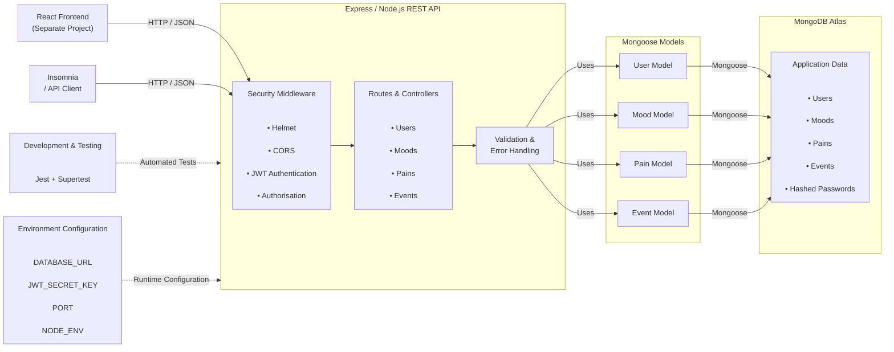
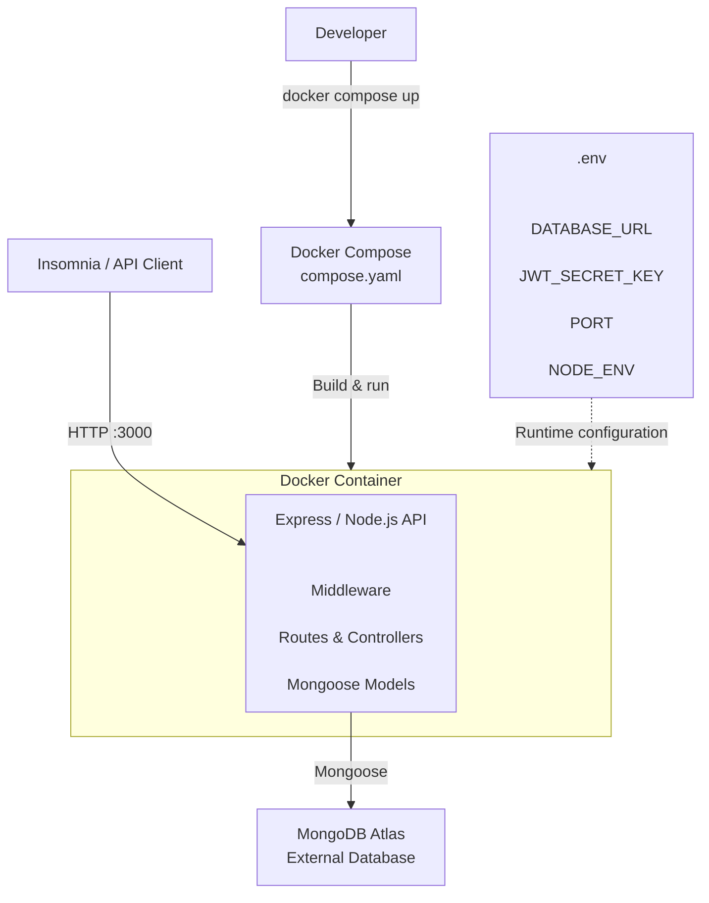
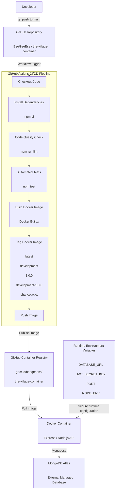

# Explanation of Application Architecture

## Application Architecture

The following diagram represents the existing architecture of The Village Wellness App backend before containerisation.



The Village Wellness App uses client-server architecture, where a React front-end (seperate project) communicates with an Express.js/Node.js REST API. The backend processes HTTP requests, validates data, authenticates and authorises users, and connects to a MongoDB Atlas database, through Mongoose.

### React

The React frontend communicates with the backend via HTTP requests and JSON data. API clients such as Insomnia, can be used to communicate with data via the Express.js API, rather than the directly within the database. For example, when the container is running locally on port 3000, Insomnia can send a request to:

`http://localhost:3000`

This allows the API to be verified independently of the frontend.

React is outside of the scope of the current project, but has been reflected in the architecture for context.

### Express.js & Node.js

The Express.js application takes a central role in processing - receiving requests from clients, validating data, applying authentication and security middleware, routing requests to controllers, and communicating with the database.

#### API

The backend is implemented using Node.js and Express.js.
Express provides the HTTP server and routing framework used to expose RESTful endpoints for the application’s resources, including:

- Users
- Moods
- Pains
- Users

The API follows a REST-style architecture where clients interact with resources through HTTP methods such as GET, POST, PUT and DELETE.

#### Security

The API has incorporated several middlware security components:

- Helmet: To apply security-related HTTP headers to responses - to protect against common web app vulnerabilities
- CORS: Provides browser-level cross-origin access controls
- JSON Web Tokens (JWTs): The API can issue JWTs to the client, the client can send the token (in the form of a bearer token) in the authorization header of a HTTP request to verify authentication. JWTs are stored as JWT_SECRET_KEY environment variables, so that secrets are not being committed to Git repositories
- Authorisation: Once the user is authenticated and can gain access to the application, authorisation is granted based on user roles i.e admin/basic user

#### Routes & Controllers

The application keeps each route seperate so that requests for moods are handled separately to requests related to pain.

The backend has the following routes:

- Users
- Pains
- Moods
- Events

The routing works alongside the authentication and authorisation middleware, ensuring that only registered users, with the appropriate role can access certain endpoints.

#### Error Handling

Mongoose schemas determine rules for how data is stored, and route-level validation ensures that requests have the appropriate information to be processed and stored.

The API provides consistent HTTP error responses to ensure that sensitive information is not exposed. As well as ensuring the the client receives consistent messaging:

- 400 — Bad Request
- 401 — Unauthorised
- 403 — Forbidden
- 404 — Not Found
- 500 — Internal Server Error

#### Testing

The project uses ESLint, Jest and Supertest to validate the backend application.

ESLint is used for static code analysis and code-quality checking:

`npm run lint`

Jest and Supertest are used to test the Express.js API and application behaviour:

`npm test`

The test suite is organised into five test files covering the server and the major application routers:

- server.test.js
- userRouter.test.js
- moodRouter.test.js
- painRouter.test.js
- eventRouter.test.js

The current test suite contains 5 test suites and 19 automated tests.

The tests use the application's database connection and environment configuration to test API behaviour, including user authentication, authorisation and the application's main resources.

#### Environment Variables

The application uses environment variables to separate configuration from application source code.

The primary environment variables are:

- DATABASE_URL — MongoDB Atlas connection string
- JWT_SECRET_KEY — secret used for JWT operations
- PORT — port used by the Express server
- NODE_ENV — identifies the application environment

For local development, these values can be supplied through a .env file. The .env file is excluded using .gitignore, an example.env file is included as a guide on what environment variables need to be added to a local copy of the project.

### MongoDB Atlas

MongoDB Atlas persists data and communicates with Express.js via mongoose - an object data modelling layer.

The database stores application data including:

- User records
- Mood records
- Pain records
- Event records
- Password hashes

Mongoose provides schemas and models that allow the Node.js application to interact with MongoDB. The MongoDB Atlas database intentionally remains outside of the Docker container - to ensure that the container remains stateless in relation to persistent app data.

The database is connected via environment variables `DATABASE_URL`, rather than being hardcoded to source code.

There is a clear separation of concerns between Express.js/Node.js, React, and MongoDB Atlas, which ensures that each application has clear responsibilities and limited access.

## Containerised Architecture

The following diagram represents the architecture of The Village Wellness App backend after the Express.js application has been containerised using Docker for development. The container provides a consistent development environment through Docker compose, containing the Node.js runtime, application source code, and production dependencies. while MongoDB Atlas remains an external managed database.

The containerised architecture builds upon the application architecture.



### Docker Containerisation

Docker is used to package the Express.js backend application and its runtime dependencies into a portable container image.

The project uses a Dockerfile to define how the container image is constructed. The Dockerfile uses the official Node.js 26 Alpine image as its base:

`FROM node:26-alpine`

Alpine Linux provides a relatively lightweight Linux environment, helping to reduce the size of the container compared with larger general-purpose base images.

The Dockerfile copies the package.json and package-lock.json files before installing dependencies:

`COPY package*.json ./
RUN npm ci --omit=dev`

Copying the package files before the application source also ensures that if the application source changes but the dependencies remain unchanged, Docker can reuse the existing dependencies during subsequent builds.

The --omit=dev option installs only the dependencies required to run the application. Development dependencies such as Jest and Supertest are therefore excluded from the production runtime image.

The application source code is then copied into the image:

`COPY src ./src`

The Dockerfile configures NODE_ENV and PORT as configurable environment variables. The default NODE_ENV is development, while the default application port is 3000.

The container exposes port 3000 by default:

`EXPOSE ${PORT}`

This allows the Express.js server to receive HTTP requests through the configured container port.

The container also runs using the non-root node user:

`USER node`

Running the application as a non-root user provides an additional security measure by reducing the privileges available to the application process inside the container.

Sensitive configuration is not stored in the Dockerfile. The .gitignore and .dockerignore files ensure this. Database credentials and authentication secrets are supplied to the container at runtime through environment variables.

The resulting image therefore contains the application and its runtime dependencies without embedding environment-specific secrets.

### Docker Development Environment

Docker Desktop is used as the local Docker engine and integrates with the project's WSL2/Ubuntu development environment.

Docker Compose is used to define the development container configuration through compose.yaml.

The Compose configuration builds the application from the project's Dockerfile:

```js
build:
  context: .
  dockerfile: Dockerfile
```

The development container can be built using:

`docker compose build`

The container can then be started using:

`docker compose up`

The Compose configuration maps port 3000 on the host machine to port 3000 inside the container:

```js
ports: -"3000:3000";
```

This allows API requests to be sent to the container through:

`http://localhost:3000`

## CI/CD Architecture

The following diagram represents the continuous integration and continuous delivery (CI/CD) architecture used to automatically validate, build, tag, and publish the containerised backend application to GitHub Container Registry.

The CI/CD architecture builds on the previous application architecture and containerisation architecture.



### CI/CD Build

GitHub Actions is used to automate the validation, Docker image build and publishing process.

The workflow is triggered automatically when changes are pushed to the main branch.

The current workflow performs the following stages:

1. Checks out the repository using GitHub Actions.
2. Sets up Node.js 26.
3. Installs the project's dependencies using:
   `npm ci`
4. Runs ESLint using:
   `npm run lint`
5. Runs the Jest and Supertest automated test suite using:
   `npm test`
6. Sets up Docker Buildx for building the container image.
7. Authenticates with GitHub Container Registry using the GitHub-provided GITHUB_TOKEN.
8. Builds the Docker image using the project's Dockerfile.
9. Publishes the resulting Docker image to GitHub Container Registry.

The workflow therefore creates an automated quality gate before the Docker image is published. The container image is not built and pushed if the application's linting or automated tests fail.

The workflow also uses GitHub Actions Secrets for sensitive configuration required by the automated tests. The MongoDB Atlas connection string and JWT secret are provided to the workflow through:

`DATABASE_URL`

`JWT_SECRET_KEY`

These values are stored as GitHub repository secrets rather than being committed to the repository.

This separates application configuration and sensitive credentials from the application source code and Docker image.

The successful execution of the workflow demonstrates that the application's automated validation and Docker image publishing process operates successfully.

### Github Container Registry (GHCR)

GitHub Container Registry stores the Docker images produced by the CI/CD workflow.

The registry path is:

`ghcr.io/beegeeess/the-village-container:(insert tag)`

Using GHCR keeps the container images associated with the GitHub repository and its source-code history.

The image tags allow a specific version or commit to be identified and deployed.

The projects tags are:

- ghcr.io/beegeeess/the-village-container:latest
- ghcr.io/beegeeess/the-village-container:development
- ghcr.io/beegeeess/the-village-container:testing
- ghcr.io/beegeeess/the-village-container:production
- ghcr.io/beegeeess/the-village-container:${{ env.APP_VERSION }}
- ghcr.io/beegeeess/the-village-container:production-${{ env.APP_VERSION }}
- ghcr.io/beegeeess/the-village-container:sha-${{ env.SHORT_SHA }}

The registry provides a central location from which the container image can be retrieved and run independently of the developer's local Docker environment.

For example, the production image can be retrieved using:

`docker pull ghcr.io/beegeeess/the-village-container:production`

The image can then be run locally with the required environment configuration supplied at runtime.

Using GHCR also separates the built container image from the source code repository. GitHub Actions is responsible for automatically building and publishing the image, while Docker can retrieve the published image when it is required.

### Testing & Validation

Testing is kept separate from the runtime container dependencies because the Dockerfile uses:

RUN npm ci --omit=dev

This prevents development-only dependencies such as Jest and Supertest from being unnecessarily included in the runtime image.

GitHub Actions acts as a quality gate by running linting and automated tests before the Docker image is built and published.

## Architecture Justification

The architecture was selected because it provides separation of responsibilities, portability, security and maintainability.

Express.js provides a lightweight framework for implementing the REST API, while MongoDB Atlas provides managed persistent storage. Mongoose provides a structured interface between the application and database.

Docker provides consistency between development and deployment environments by packaging the application and its runtime dependencies into a reproducible image.
GitHub Actions automates the image-building process, reducing manual deployment steps and providing a repeatable CI/CD workflow.

GHCR provides a central location for versioned container images and allows images to be identified using environment, application version and Git commit information.

Externalising MongoDB Atlas and application secrets means that the container remains portable and does not contain environment-specific credentials.

This architecture supports reproducible development, automated builds, secure configuration and traceable container versions while maintaining a clear separation between the application, infrastructure and persistent data.
