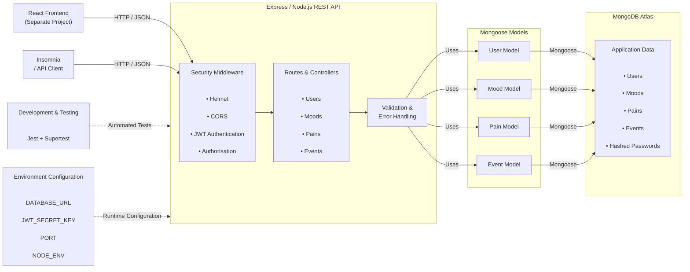
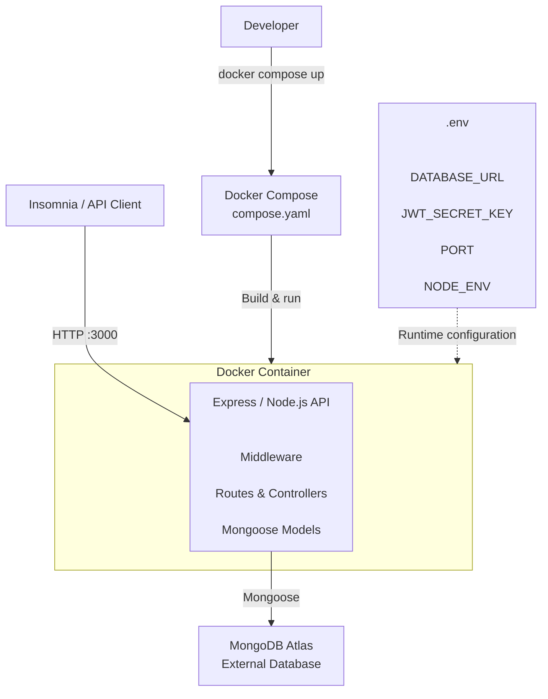
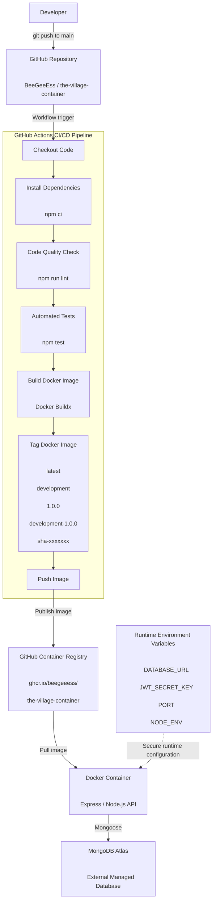

# Explanation of Application Architecture

## Application Architecture

The following diagram represents the existing architecture of The Village Wellness App backend before containerisation.

**Figure 1: Existing Application Architecture**

## Containerised Architecture

The following diagram represents the architecture of The Village Wellness App backend after the Express.js application has been containerised using Docker for development. Docker Compose manages the development container, while MongoDB Atlas remains an external managed database.

**Figure 2: Containerised Development Architecture**

## CI/CD Architecture

The following diagram represents the continuous integration and continuous delivery (CI/CD) architecture used to automatically validate, build, tag, and publish the containerised backend application to GitHub Container Registry.

GitHub Actions performs code-quality checks and automated testing before building the Docker image.

The resulting image is versioned using environment, application version, and Git commit information before being published to GitHub Container Registry.

Runtime environment variables and secrets are supplied separately and are not stored in the Docker image.

**Figure 3: CI/CD Architecture**